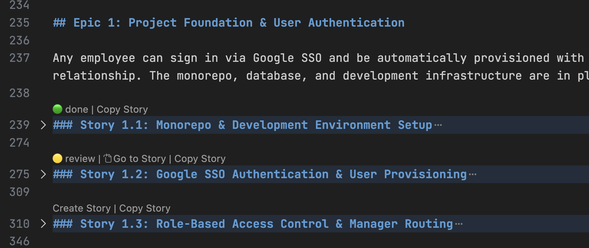
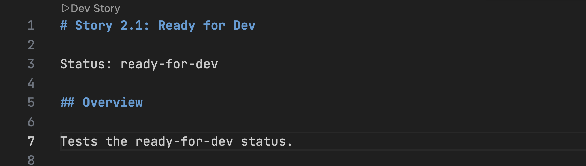

# BMad CodeLens

A VS Code / Cursor extension that integrates with the [BMad](https://docs.bmad-method.org/) AI-driven development workflow. It surfaces CodeLens action buttons directly above story headers in your markdown files, so you can trigger BMad AI agent commands.

<!-- TODO: add screenshot of the extension in action (epic file with CodeLens buttons) -->


## What it does

When you open a BMad **epic file** or a **story implementation file** in your editor, the extension reads story IDs and their statuses and injects clickable buttons (CodeLens) above each story header. Clicking a button opens GitHub Copilot Chat with the appropriate BMad slash command and story ID pre-filled or falls back to copying the command to the clipboard if chat is unavailable.

This removes the need to manually type story IDs and slash commands, keeping you in flow while working through a BMad sprint.

## Install

Download the latest `.vsix` from the [Releases](https://github.com/LucaLanziani/bmad-codelens/releases) page, then install it:

```bash
# VS Code
code --install-extension bmad-codelens-<version>.vsix

# Cursor
cursor --install-extension bmad-codelens-<version>.vsix
```

After installing, reload the editor window (`Cmd+Shift+P` → "Reload Window").

## Features

### Epic files (`### Story X.Y: Title`)

Configurable action buttons appear above each story header:
- **Create Story** — runs `/bmad-bmm-create-story` (hidden when an implementation file already exists)
- **Copy Story** — copies the full story markdown to clipboard

When a matching implementation artifact file exists, additional controls appear:
- A **status badge** showing the current story status
- A **Go to Story** button (hidden when status is `done`) that opens the implementation file

| Status | Badge | Meaning |
|--------|-------|---------|
| `ready-for-dev` | 🔵 ready-for-dev | Implementation file exists, development not started or in progress |
| `review` | 🟡 review | Story is in code review |
| `done` | 🟢 done | Story is complete |

### Story implementation files (`# Story X.Y: Title`)

<!-- TODO: add screenshot of story implementation file CodeLens button -->


A single status-dependent action button appears above the header:

| Status | Action | Command |
|--------|--------|---------|
| `ready-for-dev` | Dev Story | `/bmad-bmm-dev-story` |
| `review` | Code Review | `/bmad-bmm-code-review` |
| `done` | *(no action)* | — |

### How it works

Clicking a button opens the Copilot Chat panel with the slash command and story ID pre-filled. If chat is unavailable, the command is copied to the clipboard instead.

### Action behavior modes

Each action has a `behavior` field that controls what happens when you click the CodeLens button:

| Behavior | What it does |
|----------|---------------|
| `clipboard` | Copies the generated text to the clipboard (command + story ID, or full story text when no command prefix is set). |
| `chat` | Opens Copilot Chat with the generated text pre-filled; you press Enter to send. |
| `chat-submit` | Opens Copilot Chat and submits the generated text immediately. |
| `new-chat` | Starts a new Copilot Chat session, then opens chat with the generated text pre-filled; you press Enter to send. |
| `new-chat-submit` | Starts a new Copilot Chat session, then opens chat and submits the generated text immediately. |

Status is resolved by matching story IDs to implementation artifact files (e.g. Story `1.1` matches `1-1-*.md` in `implementation-artifacts/`), then reading the `Status:` field from the file.

## Configuration

Settings available under `bmadCodelens.*`:

| Setting | Default | Description |
|---------|---------|-------------|
| `bmadCodelens.enabled` | `true` | Enable/disable CodeLens buttons |
| `bmadCodelens.outputFolder` | `_bmad-output` | Relative path to the BMad output folder that contains `implementation-artifacts/` |
| `bmadCodelens.bmadFolder` | `_bmad` | Relative path to the BMad installation folder used to detect whether to show the “Install BMad” status bar button |
| `bmadCodelens.actions` | See extension defaults | Actions shown in epic files (`Create Story`, `Copy Story`, etc.); each entry supports `label`, `commandPrefix`, and `behavior` |
| `bmadCodelens.devStoryAction` | `Dev Story` + `/bmad-bmm-dev-story` + `new-chat` | Action used in story implementation files when status is `ready-for-dev` |
| `bmadCodelens.codeReviewAction` | `Code Review` + `/bmad-bmm-code-review` + `new-chat` | Action used in story implementation files when status is `review` |

To change action behavior, edit the `behavior` value on:
- each item in `bmadCodelens.actions`
- `bmadCodelens.devStoryAction.behavior`
- `bmadCodelens.codeReviewAction.behavior`

Allowed values are: `clipboard`, `chat`, `chat-submit`, `new-chat`, `new-chat-submit`.

## Contributing

See [CONTRIBUTING.md](CONTRIBUTING.md) for build instructions, development setup, testing, and release process.

